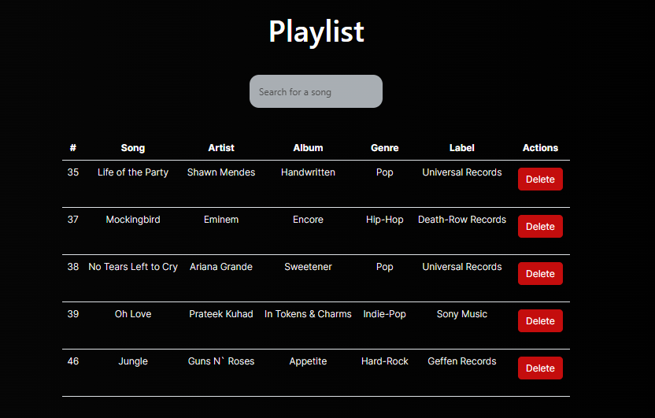
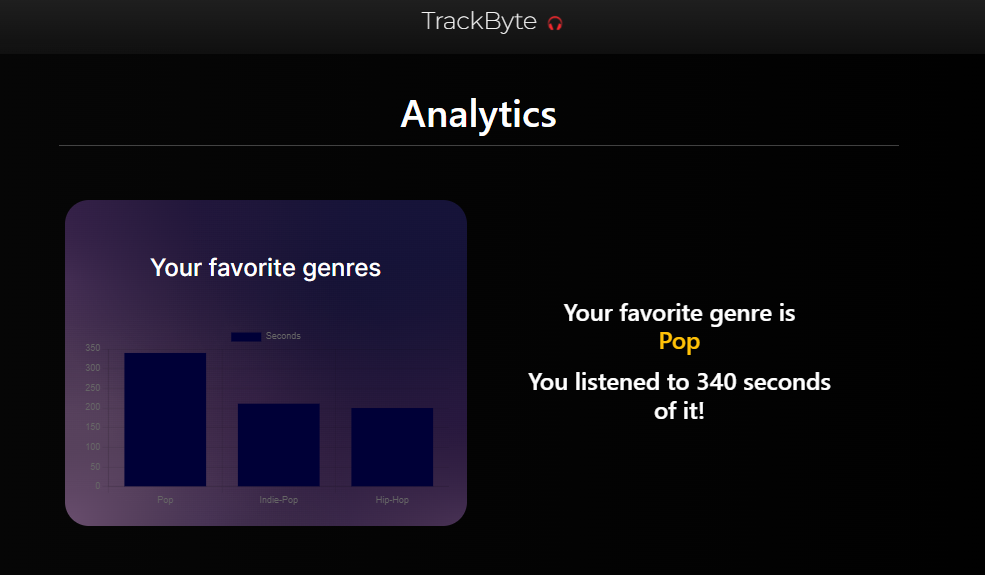
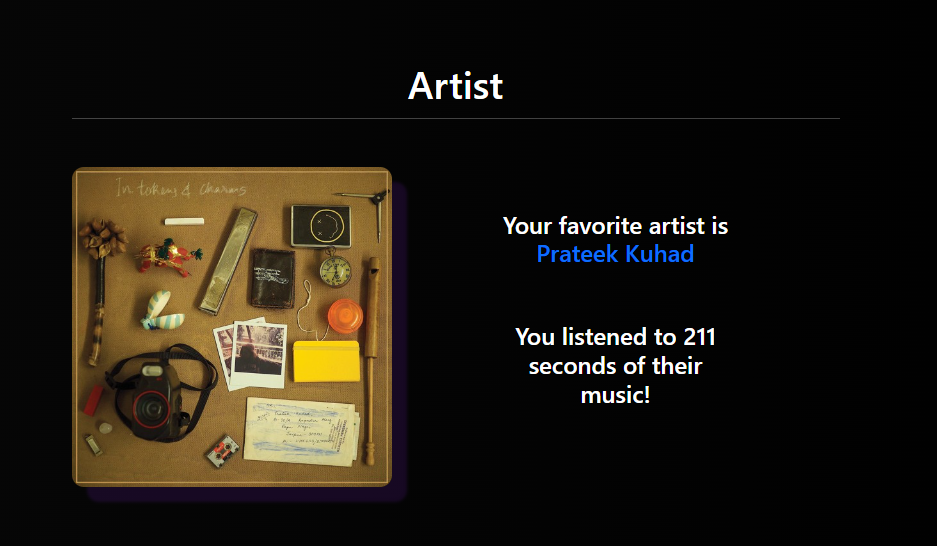

# TrackByte 🎶  
### [Deployed link](https://track-byte.vercel.app)
### Index
- [TrackByte 🎶](#trackbyte-)
    - [Deployed link](#deployed-link)
    - [Index](#index)
    - [Tech stack](#tech-stack)
    - [System Architecture](#system-architecture)
    - [Database Design](#database-design)
      - [ER Diagram](#er-diagram)
      - [Database Schema](#database-schema)
    - [Screenshots](#screenshots)

### Tech stack 
  * Frontend
     * ReactJS 
  * Backend     
     * NodeJS 
     * ExpressJS
  * Database    
     * MySQL
  * API testing  
     * PostmanAPI
  * Source & Version control 
     * Git 
     * Github
     
### System Architecture

### Database Design
#### ER Diagram

#### Database Schema

### Screenshots

